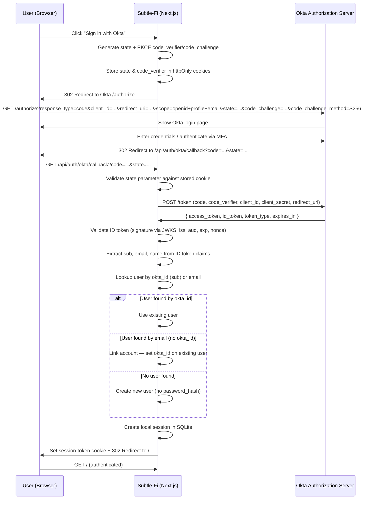

# Okta OAuth / OIDC Integration — Product & Engineering Specification

**Document Version:** 1.0
**Date:** 2026-03-19
**Status:** Draft
**Author:** Engineering Team

---

## Table of Contents

1. [Overview / Objective](#1-overview--objective)
2. [Background](#2-background)
3. [Scope](#3-scope)
4. [User Stories / Use Cases](#4-user-stories--use-cases)
5. [Technical Design](#5-technical-design)
6. [Security Considerations](#6-security-considerations)
7. [UI/UX Design](#7-uiux-design)
8. [Configuration & Environment](#8-configuration--environment)
9. [Testing Plan](#9-testing-plan)
10. [Rollout Plan](#10-rollout-plan)
11. [Dependencies](#11-dependencies)
12. [Open Questions / Future Considerations](#12-open-questions--future-considerations)

---

## 1. Overview / Objective

### Why Okta OAuth?

Subtle-Fi currently relies exclusively on email/password authentication backed by a local SQLite database. As the platform grows toward enterprise adoption, there is increasing demand for:

- **Enterprise SSO** — Organizations expect employees to authenticate via their corporate identity provider rather than managing separate credentials for each SaaS tool.
- **Improved security posture** — Delegating authentication to Okta leverages their MFA enforcement, adaptive access policies, and centralized session revocation capabilities.
- **Reduced password management burden** — Users no longer need to create and remember yet another password. Okta-managed users benefit from single sign-on across all their tools.

### Goal

Integrate Okta as an OAuth 2.0 / OpenID Connect (OIDC) identity provider into Subtle-Fi's existing authentication system, supporting **both** Okta OAuth and existing email/password login side by side. Existing password-based users must remain completely unaffected.

---

## 2. Background

### Current Authentication System

Subtle-Fi uses a custom, cookie-based session system with the following characteristics:

| Component | Detail |
|---|---|
| **Password hashing** | `bcryptjs` with 10 salt rounds |
| **Session storage** | SQLite `sessions` table via `better-sqlite3` |
| **Session lifetime** | 30 days from creation |
| **Session cookie** | `session-token` — `httpOnly`, `sameSite: strict`, `secure` (in production) |
| **Server actions** | `lib/actions/user.actions.ts` — `signInUser`, `createNewUser`, `signOutUser`, `getCurrentUser` |
| **Auth logic** | `lib/db/auth.ts` — `createUser`, `verifyPassword`, `createSession`, `getSession`, `deleteSession` |
| **Route protection** | `app/(root)/layout.tsx` calls `getCurrentUser()` and redirects to `/sign-in` if null — no Next.js middleware |
| **Client-side** | `components/AuthForm.tsx` — unified component handling both sign-in and sign-up forms |
| **Validation** | Zod schemas in `lib/utils.ts` (`authFormSchema`) with dynamic fields based on form type |
| **Database** | `lib/db/schema.ts` — `users`, `sessions`, `banks` tables in SQLite |

### Limitations

- No support for federated identity / SSO.
- All users must manage a local password.
- No MFA enforcement at the application level.
- No centralized user provisioning or deprovisioning.
- Enterprise customers cannot enforce their organization's authentication policies.

---

## 3. Scope

### In Scope

- **Okta OIDC Authorization Code flow with PKCE** — Full server-side implementation.
- **Account linking** — Okta users whose email matches an existing local user are linked automatically.
- **New Okta-only user creation** — Users without a pre-existing account are created without a password hash.
- **UI changes** — "Sign in with Okta" button on sign-in and sign-up pages.
- **Session integration** — Okta-authenticated users receive the same local session as password-authenticated users.
- **Sign-out integration** — Optionally redirect to Okta's logout endpoint on sign-out.
- **Feature flag** — Ability to enable/disable Okta login via environment variable.

### Out of Scope

- Migrating all existing users off password-based authentication.
- SAML 2.0 integration.
- Multi-tenant Okta organization support (single Okta org assumed).
- Okta-managed user provisioning via SCIM.
- Okta group-to-application-role mapping (future consideration).
- Refresh token rotation or silent re-authentication.
- Next.js middleware-based route protection (current `layout.tsx` pattern is retained).

---

## 4. User Stories / Use Cases

### US-1: New user signs up via Okta

> As a new user, I want to click "Sign in with Okta" on the sign-up page so that I can create an account without setting a local password.

**Acceptance Criteria:**
- User clicks "Sign in with Okta" and is redirected to Okta's login page.
- After authenticating with Okta, a new user record is created in the `users` table with the `okta_id` populated and `password_hash` set to `NULL`.
- A local session is created and the user is redirected to `/`.

### US-2: Existing user links Okta account

> As an existing email/password user, I want to sign in with Okta using the same email address so that my accounts are automatically linked.

**Acceptance Criteria:**
- User authenticates via Okta with an email that matches an existing user record.
- The existing user record's `okta_id` column is updated with the Okta subject identifier.
- The user is signed in with a new local session.

### US-3: Returning user signs in via Okta

> As a returning user who has previously linked their Okta account, I want to click "Sign in with Okta" and be signed in immediately after authenticating with Okta.

**Acceptance Criteria:**
- User is looked up by `okta_id` and a session is created.
- No new user record is created.

### US-4: Dual-method user uses either login method

> As a user who has both an Okta-linked account and a local password, I want to be able to sign in using either method.

**Acceptance Criteria:**
- User can sign in via email/password as before.
- User can sign in via Okta and both methods resolve to the same user record.

### US-5: Sign-out clears both sessions

> As a signed-in user, I want signing out to clear both my local session and (optionally) my Okta session.

**Acceptance Criteria:**
- Local `session-token` cookie is deleted and the session row is removed from SQLite.
- If the user authenticated via Okta, the browser is redirected to Okta's `/logout` endpoint with `post_logout_redirect_uri` pointing back to `/sign-in`.

---

## 5. Technical Design

### 5.1 Okta Configuration

#### Application Setup in Okta Admin Console

| Setting | Value |
|---|---|
| **Application type** | Web Application |
| **Grant types** | Authorization Code |
| **Sign-in redirect URIs** | `http://localhost:3000/api/auth/okta/callback` (dev), `https://<production-domain>/api/auth/okta/callback` (prod) |
| **Sign-out redirect URIs** | `http://localhost:3000/sign-in` (dev), `https://<production-domain>/sign-in` (prod) |
| **Scopes** | `openid`, `profile`, `email` |
| **PKCE** | Required (enforced by both client and Okta) |

#### Environment Variables

```env
# Okta OIDC Configuration
OKTA_ISSUER=https://<your-okta-domain>/oauth2/default
OKTA_CLIENT_ID=<okta-client-id>
OKTA_CLIENT_SECRET=<okta-client-secret>
OKTA_REDIRECT_URI=http://localhost:3000/api/auth/okta/callback
OKTA_POST_LOGOUT_REDIRECT_URI=http://localhost:3000/sign-in

# Feature flag
NEXT_PUBLIC_OKTA_ENABLED=false
```

### 5.2 Auth Flow

#### Authorization Code Flow with PKCE — Sequence Diagram



#### Step-by-Step Flow

1. **User clicks "Sign in with Okta"** — Browser navigates to `/api/auth/okta`.
2. **Server generates security parameters** — `state` (random string for CSRF protection) and PKCE `code_verifier` / `code_challenge` pair.
3. **Server stores state and code_verifier** — Stored in `httpOnly`, `sameSite: lax`, `secure` cookies (short-lived, e.g., 10 minutes).
4. **Server redirects to Okta** — `302` to Okta's `/authorize` endpoint with query parameters: `response_type=code`, `client_id`, `redirect_uri`, `scope=openid profile email`, `state`, `code_challenge`, `code_challenge_method=S256`.
5. **User authenticates on Okta** — Okta handles login UI, MFA prompts, etc.
6. **Okta redirects back** — `302` to `/api/auth/okta/callback?code=<auth_code>&state=<state>`.
7. **Server validates state** — Compares the `state` query parameter against the stored cookie value. Rejects if mismatched.
8. **Server exchanges code for tokens** — `POST` to Okta's `/token` endpoint with `grant_type=authorization_code`, the `code`, `code_verifier`, `client_id`, `client_secret`, and `redirect_uri`.
9. **Server validates ID token** — Verifies JWT signature against Okta's JWKS endpoint, checks `iss` matches `OKTA_ISSUER`, `aud` matches `OKTA_CLIENT_ID`, and `exp` is in the future.
10. **Server resolves user** — Extracts `sub` (Okta user ID), `email`, `name`/`given_name`/`family_name` from the ID token claims. Looks up user by `okta_id`, then by `email`, or creates a new user.
11. **Server creates local session** — Calls `createSession(user.id)` (same as password auth).
12. **Server sets session cookie** — Sets `session-token` cookie with the session ID.
13. **Server redirects to `/`** — User lands on the authenticated dashboard.

### 5.3 Database Changes

#### Schema Change: Add `okta_id` to `users` table

```sql
ALTER TABLE users ADD COLUMN okta_id TEXT UNIQUE;
```

**Column details:**

| Column | Type | Constraints | Description |
|---|---|---|---|
| `okta_id` | `TEXT` | `UNIQUE`, `NULLABLE` | Okta subject identifier (`sub` claim). `NULL` for password-only users. |

#### Migration Strategy

Since the app uses `CREATE TABLE IF NOT EXISTS` for schema initialization (in `lib/db/schema.ts`), the migration will be handled as follows:

1. Update the `CREATE TABLE` statement in `schema.ts` to include `okta_id TEXT UNIQUE`.
2. Add a migration check after table creation that adds the column if it doesn't exist (for existing databases):

```typescript
// In getDb() after CREATE TABLE statements
db.exec(`
  -- Add okta_id column if it doesn't exist (migration for existing databases)
  ALTER TABLE users ADD COLUMN okta_id TEXT UNIQUE;
`);
```

> **Note:** SQLite's `ALTER TABLE ADD COLUMN` is a no-op error if the column already exists. Wrap in a try-catch or use a pragma-based check.

#### Updated `password_hash` Constraint

The `password_hash` column must become `NULLABLE` to support Okta-only users who have no local password:

```sql
-- Current: password_hash TEXT NOT NULL
-- Updated: password_hash TEXT  (nullable)
```

This change is backward-compatible since all existing users already have a `password_hash` value.

### 5.4 New Files / Endpoints

#### `app/api/auth/okta/route.ts` — Initiate OAuth Flow

Handles `GET /api/auth/okta`:

```typescript
// app/api/auth/okta/route.ts
import { NextResponse } from "next/server";
import { generateAuthUrl, generatePKCE, generateState } from "@/lib/okta";

export async function GET() {
  const state = generateState();
  const { codeVerifier, codeChallenge } = await generatePKCE();

  const authUrl = generateAuthUrl({
    state,
    codeChallenge,
  });

  const response = NextResponse.redirect(authUrl);

  // Store state and code_verifier in httpOnly cookies
  response.cookies.set("okta-state", state, {
    httpOnly: true,
    sameSite: "lax",
    secure: process.env.NODE_ENV === "production",
    maxAge: 600, // 10 minutes
    path: "/",
  });

  response.cookies.set("okta-code-verifier", codeVerifier, {
    httpOnly: true,
    sameSite: "lax",
    secure: process.env.NODE_ENV === "production",
    maxAge: 600,
    path: "/",
  });

  return response;
}
```

#### `app/api/auth/okta/callback/route.ts` — Handle OAuth Callback

Handles `GET /api/auth/okta/callback`:

```typescript
// app/api/auth/okta/callback/route.ts
import { NextRequest, NextResponse } from "next/server";
import { exchangeCodeForTokens, validateIdToken } from "@/lib/okta";
import {
  getUserByOktaId,
  getUserByEmail,
  createOktaUser,
  linkOktaAccount,
  createSession,
} from "@/lib/db/auth";

export async function GET(request: NextRequest) {
  const searchParams = request.nextUrl.searchParams;
  const code = searchParams.get("code");
  const state = searchParams.get("state");
  const error = searchParams.get("error");

  // Handle Okta errors (e.g., user cancelled)
  if (error) {
    const errorDescription = searchParams.get("error_description") || "Authentication failed";
    return NextResponse.redirect(
      new URL(`/sign-in?error=${encodeURIComponent(errorDescription)}`, request.url)
    );
  }

  // Validate state
  const storedState = request.cookies.get("okta-state")?.value;
  if (!state || !storedState || state !== storedState) {
    return NextResponse.redirect(
      new URL("/sign-in?error=Invalid+state+parameter", request.url)
    );
  }

  // Retrieve code verifier
  const codeVerifier = request.cookies.get("okta-code-verifier")?.value;
  if (!code || !codeVerifier) {
    return NextResponse.redirect(
      new URL("/sign-in?error=Missing+authorization+code", request.url)
    );
  }

  try {
    // Exchange code for tokens
    const tokens = await exchangeCodeForTokens(code, codeVerifier);

    // Validate ID token
    const claims = await validateIdToken(tokens.id_token);

    // Resolve user
    const oktaId = claims.sub;
    const email = claims.email as string;
    const firstName = (claims.given_name as string) || (claims.name as string)?.split(" ")[0] || "";
    const lastName = (claims.family_name as string) || (claims.name as string)?.split(" ").slice(1).join(" ") || "";

    let user = await getUserByOktaId(oktaId);

    if (!user) {
      // Check if a user with this email already exists
      const existingUser = await getUserByEmail(email);
      if (existingUser) {
        // Link Okta account to existing user
        user = await linkOktaAccount(existingUser.id, oktaId);
      } else {
        // Create new Okta-only user
        user = await createOktaUser({ oktaId, email, firstName, lastName });
      }
    }

    // Create local session
    const session = await createSession(user!.id);

    // Build response with session cookie
    const response = NextResponse.redirect(new URL("/", request.url));

    response.cookies.set("session-token", session.id, {
      path: "/",
      httpOnly: true,
      sameSite: "strict",
      secure: process.env.NODE_ENV === "production",
      expires: session.expiresAt,
    });

    // Clean up OAuth cookies
    response.cookies.delete("okta-state");
    response.cookies.delete("okta-code-verifier");

    return response;
  } catch (err) {
    console.error("Okta callback error:", err);
    return NextResponse.redirect(
      new URL("/sign-in?error=Authentication+failed", request.url)
    );
  }
}
```

#### `lib/okta.ts` — Okta Utility Functions

```typescript
// lib/okta.ts
import crypto from "crypto";

interface OktaTokenResponse {
  access_token: string;
  id_token: string;
  token_type: string;
  expires_in: number;
  scope: string;
}

interface OktaIdTokenClaims {
  sub: string;
  email?: string;
  name?: string;
  given_name?: string;
  family_name?: string;
  iss: string;
  aud: string;
  exp: number;
  iat: number;
  [key: string]: unknown;
}

export function generateState(): string {
  return crypto.randomBytes(32).toString("hex");
}

export async function generatePKCE(): Promise<{
  codeVerifier: string;
  codeChallenge: string;
}> {
  const codeVerifier = crypto.randomBytes(32).toString("base64url");
  const hash = crypto.createHash("sha256").update(codeVerifier).digest();
  const codeChallenge = hash.toString("base64url");
  return { codeVerifier, codeChallenge };
}

export function generateAuthUrl(params: {
  state: string;
  codeChallenge: string;
}): string {
  const issuer = process.env.OKTA_ISSUER!;
  const clientId = process.env.OKTA_CLIENT_ID!;
  const redirectUri = process.env.OKTA_REDIRECT_URI!;

  const url = new URL(`${issuer}/v1/authorize`);
  url.searchParams.set("response_type", "code");
  url.searchParams.set("client_id", clientId);
  url.searchParams.set("redirect_uri", redirectUri);
  url.searchParams.set("scope", "openid profile email");
  url.searchParams.set("state", params.state);
  url.searchParams.set("code_challenge", params.codeChallenge);
  url.searchParams.set("code_challenge_method", "S256");

  return url.toString();
}

export async function exchangeCodeForTokens(
  code: string,
  codeVerifier: string
): Promise<OktaTokenResponse> {
  const issuer = process.env.OKTA_ISSUER!;
  const clientId = process.env.OKTA_CLIENT_ID!;
  const clientSecret = process.env.OKTA_CLIENT_SECRET!;
  const redirectUri = process.env.OKTA_REDIRECT_URI!;

  const response = await fetch(`${issuer}/v1/token`, {
    method: "POST",
    headers: { "Content-Type": "application/x-www-form-urlencoded" },
    body: new URLSearchParams({
      grant_type: "authorization_code",
      code,
      code_verifier: codeVerifier,
      client_id: clientId,
      client_secret: clientSecret,
      redirect_uri: redirectUri,
    }),
  });

  if (!response.ok) {
    throw new Error(`Token exchange failed: ${response.statusText}`);
  }

  return response.json();
}

export async function validateIdToken(
  idToken: string
): Promise<OktaIdTokenClaims> {
  // Implementation: Use jose library to verify JWT signature
  // against Okta's JWKS endpoint
  // Verify: iss, aud, exp claims
  throw new Error("Not implemented — use jose or @okta/jwt-verifier");
}

export function getOktaLogoutUrl(): string {
  const issuer = process.env.OKTA_ISSUER!;
  const clientId = process.env.OKTA_CLIENT_ID!;
  const postLogoutUri = process.env.OKTA_POST_LOGOUT_REDIRECT_URI!;

  const url = new URL(`${issuer}/v1/logout`);
  url.searchParams.set("client_id", clientId);
  url.searchParams.set("post_logout_redirect_uri", postLogoutUri);

  return url.toString();
}
```

### 5.5 Changes to Existing Files

#### `lib/db/schema.ts`

Add `okta_id` column to the `users` table definition and make `password_hash` nullable:

```diff
  CREATE TABLE IF NOT EXISTS users (
    id TEXT PRIMARY KEY,
    email TEXT UNIQUE NOT NULL,
-   password_hash TEXT NOT NULL,
+   password_hash TEXT,
    first_name TEXT NOT NULL,
    last_name TEXT NOT NULL,
    address1 TEXT,
    city TEXT,
    state TEXT,
    postal_code TEXT,
    date_of_birth TEXT,
    ssn TEXT,
+   okta_id TEXT UNIQUE,
    dwolla_customer_id TEXT,
    dwolla_customer_url TEXT,
    created_at TEXT DEFAULT (datetime('now')),
    updated_at TEXT DEFAULT (datetime('now'))
  );
```

Add migration logic after table creation for existing databases:

```typescript
// Migration: Add okta_id column for existing databases
try {
  db.exec(`ALTER TABLE users ADD COLUMN okta_id TEXT UNIQUE`);
} catch {
  // Column already exists — safe to ignore
}
```

#### `lib/db/auth.ts`

Add Okta-specific user functions:

```typescript
export async function getUserByOktaId(oktaId: string): Promise<User | null> {
  const db = getDb();
  const stmt = db.prepare(`SELECT * FROM users WHERE okta_id = ?`);
  const row = stmt.get(oktaId) as any;
  if (!row) return null;
  return mapRowToUser(row);
}

export async function createOktaUser(params: {
  oktaId: string;
  email: string;
  firstName: string;
  lastName: string;
}): Promise<User> {
  const id = uuidv4();
  const db = getDb();
  const stmt = db.prepare(`
    INSERT INTO users (id, email, password_hash, first_name, last_name, okta_id)
    VALUES (?, ?, NULL, ?, ?, ?)
  `);
  stmt.run(id, params.email, params.firstName, params.lastName, params.oktaId);
  return getUserById(id) as Promise<User>;
}

export async function linkOktaAccount(
  userId: string,
  oktaId: string
): Promise<User | null> {
  const db = getDb();
  const stmt = db.prepare(`UPDATE users SET okta_id = ?, updated_at = datetime('now') WHERE id = ?`);
  stmt.run(oktaId, userId);
  return getUserById(userId);
}
```

Update the `User` interface to include `oktaId`:

```typescript
export interface User {
  id: string;
  email: string;
  firstName: string;
  lastName: string;
  address1?: string;
  city?: string;
  state?: string;
  postalCode?: string;
  dateOfBirth?: string;
  ssn?: string;
  oktaId?: string;  // NEW
  dwollaCustomerId?: string;
  dwollaCustomerUrl?: string;
  $id?: string;
}
```

Update `mapRowToUser` to include the new field:

```typescript
function mapRowToUser(row: any): User {
  return {
    // ...existing fields...
    oktaId: row.okta_id,
    // ...
  };
}
```

#### `lib/actions/user.actions.ts`

Update `signOutUser()` to optionally redirect to Okta logout:

```typescript
export const signOutUser = async () => {
  try {
    const sessionToken = cookies().get("session-token");
    if (sessionToken?.value) {
      await deleteSession(sessionToken.value);
    }
    cookies().delete("session-token");

    // Note: Okta logout redirect is handled client-side.
    // The client checks if NEXT_PUBLIC_OKTA_ENABLED is true and
    // redirects to the Okta logout URL after calling this action.
  } catch (error) {
    console.error("Error", error);
  }
};
```

#### `components/AuthForm.tsx`

Add "Sign in with Okta" button below the existing form:

```tsx
{/* After the existing </Form> and before <footer> */}

{process.env.NEXT_PUBLIC_OKTA_ENABLED === "true" && (
  <>
    <div className="flex items-center gap-4 py-2">
      <div className="h-px flex-1 bg-gray-200" />
      <span className="text-14 text-gray-500">Or continue with</span>
      <div className="h-px flex-1 bg-gray-200" />
    </div>

    <Button
      type="button"
      variant="outline"
      className="w-full flex items-center justify-center gap-2 border-gray-300"
      onClick={() => {
        window.location.href = "/api/auth/okta";
      }}
    >
      <Image src="/icons/okta-logo.svg" alt="Okta" width={20} height={20} />
      Sign in with Okta
    </Button>
  </>
)}
```

#### `app/(auth)/sign-in/page.tsx` and `app/(auth)/sign-up/page.tsx`

Display OAuth error messages from query params:

```tsx
// sign-in/page.tsx
const SignIn = async ({ searchParams }: { searchParams: { error?: string } }) => {
  return (
    <section className="flex-center sixe-full max-sm:px-6">
      {searchParams.error && (
        <div className="mb-4 rounded-md bg-red-50 p-3 text-sm text-red-700">
          {decodeURIComponent(searchParams.error)}
        </div>
      )}
      <AuthForm type="sign-in" />
    </section>
  );
};
```

### 5.6 Account Linking Logic

The account linking strategy follows a priority-based lookup:

```
1. Lookup by okta_id (sub claim) → Exact match → Use existing user
2. Lookup by email → Match found → Link Okta account (set okta_id)
3. No match → Create new user (Okta-only, no password_hash)
```

**Key rules:**

- **Email matching is case-insensitive.** Normalize emails to lowercase before comparison.
- **Account linking is automatic and one-time.** Once `okta_id` is set, subsequent logins use the `okta_id` lookup path.
- **Okta-only users have `NULL` password_hash.** They cannot use the email/password login form until they set a password (future feature).
- **No duplicate `okta_id` values.** The `UNIQUE` constraint on `okta_id` prevents one Okta identity from being linked to multiple local users.

### 5.7 Session Management

The Okta integration **reuses the existing session system entirely**:

- After Okta authentication, `createSession(userId)` is called — identical to the password auth path.
- The same `session-token` cookie is set with the same flags (`httpOnly`, `sameSite: strict`, `secure`).
- `getCurrentUser()` in `lib/actions/user.actions.ts` remains **unchanged** — it reads the `session-token` cookie and resolves the user from the `sessions` table.
- Route protection in `app/(root)/layout.tsx` remains **unchanged**.
- Session expiry (30 days) applies equally to Okta and password sessions.

This design ensures **zero changes** to any downstream code that depends on `getCurrentUser()`.

---

## 6. Security Considerations

| Concern | Mitigation |
|---|---|
| **CSRF during OAuth flow** | `state` parameter generated per-request, stored in `httpOnly` cookie, validated on callback. |
| **Authorization code interception** | PKCE (`code_verifier` / `code_challenge` with S256) prevents authorization code replay attacks. |
| **ID token integrity** | JWT signature validated against Okta's JWKS endpoint (`${OKTA_ISSUER}/v1/keys`). |
| **Token claim validation** | `iss` must equal `OKTA_ISSUER`, `aud` must equal `OKTA_CLIENT_ID`, `exp` must be in the future. |
| **OAuth cookie security** | `okta-state` and `okta-code-verifier` cookies are `httpOnly`, `sameSite: lax` (required for OAuth redirects), `secure` in production, with 10-minute `maxAge`. |
| **Session cookie security** | Existing `session-token` cookie settings retained: `httpOnly`, `sameSite: strict`, `secure`. |
| **Client secret protection** | `OKTA_CLIENT_SECRET` stored only in environment variables; never exposed to the client. |
| **Email enumeration** | Account linking by email is performed server-side only; no information about existing accounts is leaked to the client. |
| **Open redirect** | Redirect URIs are hardcoded in environment variables and validated by Okta's application configuration. No user-supplied redirect targets. |
| **Token storage** | ID tokens and access tokens are not persisted. They are used only during the callback request and discarded. |
| **PKCE verifier storage** | Stored in `httpOnly` cookie rather than server-side session to remain stateless. Short-lived (10 minutes). |

---

## 7. UI/UX Design

### Updated Sign-In Page Layout

```
┌─────────────────────────────────────┐
│           SubtleTech Logo           │
│              Sign In                │
│      Please enter your details      │
│                                     │
│  ┌───────────────────────────────┐  │
│  │  Email                        │  │
│  └───────────────────────────────┘  │
│  ┌───────────────────────────────┐  │
│  │  Password                     │  │
│  └───────────────────────────────┘  │
│                                     │
│  ┌───────────────────────────────┐  │
│  │          Sign In              │  │
│  └───────────────────────────────┘  │
│                                     │
│  ─────── Or continue with ───────  │
│                                     │
│  ┌───────────────────────────────┐  │
│  │  [Okta Logo] Sign in with Okta│  │
│  └───────────────────────────────┘  │
│                                     │
│   Don't have an account? Sign Up    │
└─────────────────────────────────────┘
```

### Design Details

- **Divider** — Horizontal rule with "Or continue with" centered text, using `text-gray-500` on a `bg-gray-200` line.
- **Okta Button** — Outline-style button (`variant="outline"`) with the Okta logo (SVG) and "Sign in with Okta" label. Full-width, matching the existing form button width.
- **Loading state** — When the user clicks the Okta button, the button shows a loading spinner (reuse the existing `Loader2` component) until the redirect occurs.
- **Error display** — If the OAuth callback redirects back with an `?error=` query parameter, display a red alert banner above the form with the error message.
- **Consistent placement** — The Okta button appears on both the sign-in and sign-up pages in the same position.
- **Feature flag** — The Okta button is only rendered when `NEXT_PUBLIC_OKTA_ENABLED` is `"true"`. When disabled, the pages look exactly as they do today.

---

## 8. Configuration & Environment

### Required Environment Variables

| Variable | Description | Example |
|---|---|---|
| `OKTA_ISSUER` | Okta authorization server issuer URL | `https://dev-123456.okta.com/oauth2/default` |
| `OKTA_CLIENT_ID` | Client ID from Okta application | `0oaXXXXXXXXXXXX` |
| `OKTA_CLIENT_SECRET` | Client secret from Okta application | `XXXXXXXXXXXXXXXX` |
| `OKTA_REDIRECT_URI` | Callback URL registered in Okta | `http://localhost:3000/api/auth/okta/callback` |
| `OKTA_POST_LOGOUT_REDIRECT_URI` | Post-logout redirect URL | `http://localhost:3000/sign-in` |
| `NEXT_PUBLIC_OKTA_ENABLED` | Feature flag to show/hide Okta login button | `true` or `false` |

### Okta Admin Console Setup Steps

1. Log in to the [Okta Admin Console](https://admin.okta.com).
2. Navigate to **Applications** > **Applications** > **Create App Integration**.
3. Select **OIDC - OpenID Connect** as the sign-in method.
4. Select **Web Application** as the application type.
5. Configure:
   - **App integration name**: `Subtle-Fi`
   - **Grant type**: Authorization Code
   - **Sign-in redirect URIs**: Add both development and production callback URLs.
   - **Sign-out redirect URIs**: Add both development and production sign-in page URLs.
   - **Controlled access**: Assign to the appropriate groups or allow everyone in your org.
6. Copy the **Client ID** and **Client Secret** into your `.env` file.
7. Note the **Issuer URI** from **Security** > **API** > **Authorization Servers** (typically `https://<your-domain>.okta.com/oauth2/default`).

### `.env.example` Update

Add the following block to the existing `.env.example` file:

```env
# Okta OAuth Configuration (optional — set NEXT_PUBLIC_OKTA_ENABLED=true to enable)
OKTA_ISSUER=
OKTA_CLIENT_ID=
OKTA_CLIENT_SECRET=
OKTA_REDIRECT_URI=http://localhost:3000/api/auth/okta/callback
OKTA_POST_LOGOUT_REDIRECT_URI=http://localhost:3000/sign-in
NEXT_PUBLIC_OKTA_ENABLED=false
```

---

## 9. Testing Plan

### Unit Tests

| Test | Description |
|---|---|
| `generateState()` | Returns a 64-character hex string. |
| `generatePKCE()` | Returns a valid `code_verifier` and `code_challenge` pair. Verify that SHA-256 of verifier matches challenge. |
| `generateAuthUrl()` | Returns a well-formed URL with all required query parameters. |
| `validateIdToken()` | Rejects expired tokens. Rejects tokens with wrong `iss`. Rejects tokens with wrong `aud`. Accepts valid tokens. |
| `getUserByOktaId()` | Returns user when `okta_id` matches. Returns `null` when no match. |
| `createOktaUser()` | Creates a user with `okta_id` set and `password_hash` as `NULL`. |
| `linkOktaAccount()` | Sets `okta_id` on an existing user. Preserves all other user fields. |

### Integration Tests

| Test | Description |
|---|---|
| `GET /api/auth/okta` | Returns 302 redirect to Okta authorize URL. Sets `okta-state` and `okta-code-verifier` cookies. |
| `GET /api/auth/okta/callback` — happy path | With valid code and state, creates session and redirects to `/` with `session-token` cookie. |
| `GET /api/auth/okta/callback` — invalid state | Returns redirect to `/sign-in?error=...`. |
| `GET /api/auth/okta/callback` — account linking | When email matches existing user, sets `okta_id` on existing record. |
| `GET /api/auth/okta/callback` — new user | When no matching user, creates a new user without `password_hash`. |
| `GET /api/auth/okta/callback` — Okta error | When `?error=` is present, redirects to `/sign-in` with error message. |

### Manual E2E Test Cases

| # | Test Case | Steps | Expected Result |
|---|---|---|---|
| 1 | **Happy path — new user** | Click "Sign in with Okta" → authenticate in Okta → verify redirect to dashboard | New user created, session active, dashboard displayed |
| 2 | **Happy path — returning user** | Sign in with Okta after account already exists | Session created, dashboard displayed |
| 3 | **Account linking** | Create account with email/password → Sign in with Okta using same email | User record now has `okta_id` set, single user record |
| 4 | **Dual-method login** | After account linking, sign out → sign in with email/password | Successful sign-in, same user |
| 5 | **Expired/invalid state** | Tamper with `okta-state` cookie before callback | Error message displayed on sign-in page |
| 6 | **User cancels Okta flow** | Click "Sign in with Okta" → click "Cancel" on Okta login page | Redirected back to sign-in page with error message |
| 7 | **Expired tokens** | Delay callback beyond token expiry (simulated) | Error message displayed on sign-in page |
| 8 | **Feature flag disabled** | Set `NEXT_PUBLIC_OKTA_ENABLED=false` | Okta button not visible on sign-in/sign-up pages |
| 9 | **Sign-out with Okta** | Sign in via Okta → sign out | Local session cleared, optionally redirected to Okta logout |
| 10 | **Password-only user unaffected** | Sign in with email/password (no Okta interaction) | Works exactly as before with no changes |

---

## 10. Rollout Plan

### Phase 1: Development & Internal Testing

1. Implement behind feature flag (`NEXT_PUBLIC_OKTA_ENABLED=false` by default).
2. Deploy to staging environment with Okta disabled.
3. Enable Okta for the staging environment and test with internal team accounts.
4. Verify all E2E test cases pass.

### Phase 2: Limited Rollout

1. Enable Okta in production with `NEXT_PUBLIC_OKTA_ENABLED=true`.
2. Communicate to a small group of internal/beta users.
3. Monitor for:
   - Callback errors in Sentry.
   - Session creation failures.
   - Account linking conflicts.

### Phase 3: General Availability

1. Announce Okta SSO availability to all users.
2. Update documentation and onboarding materials.
3. Monitor adoption metrics (Okta logins vs. password logins).

### Backward Compatibility

- **Existing password users are completely unaffected.** The email/password flow is unchanged.
- **No data migration required.** The `okta_id` column is `NULLABLE` and defaults to `NULL` for all existing users.
- **No forced migration.** Users choose if and when to use Okta.
- **Feature flag provides kill switch.** If issues arise, set `NEXT_PUBLIC_OKTA_ENABLED=false` to instantly hide the Okta button without a code deploy.

---

## 11. Dependencies

### New npm Packages

| Package | Purpose | Alternative |
|---|---|---|
| [`jose`](https://github.com/panva/jose) | JWT/JWS/JWE verification, JWKS fetching | Preferred — lightweight, standards-compliant, no Okta vendor lock-in |
| [`openid-client`](https://github.com/panva/node-openid-client) | Full OIDC Relying Party implementation | More batteries-included but heavier |
| [`@okta/jwt-verifier`](https://github.com/okta/okta-jwt-verifier-js) | Okta-specific JWT verification | Okta-maintained, less flexible |
| [`@okta/okta-auth-js`](https://github.com/okta/okta-auth-js) | Full Okta SDK (client + server) | Heaviest option, most features |

### Recommended Approach

Use **`jose`** for JWT validation. It is:
- Zero-dependency.
- Works in both Node.js and Edge Runtime (relevant for future Next.js middleware adoption).
- Standards-compliant (not vendor-specific).
- Actively maintained.

All other OAuth functionality (URL building, token exchange, state/PKCE generation) is implemented with **built-in Node.js `crypto` and `fetch`** — no additional packages needed.

### Existing Dependencies (No Changes)

- `better-sqlite3` — Database (unchanged).
- `bcryptjs` — Password hashing (still used for password-based auth).
- `uuid` — ID generation (reused for new Okta users).

---

## 12. Open Questions / Future Considerations

### Open Questions

| # | Question | Context |
|---|---|---|
| 1 | Should we force Okta authentication for certain email domains? | Enterprise customers may want to require SSO for `@company.com` emails. This would require domain-based routing logic on the sign-in page. |
| 2 | What is the desired behavior when an Okta user's email changes in Okta? | Currently the email in the local database would become stale. Options: sync on each login, or treat email as immutable after creation. |
| 3 | Should Okta sign-out be mandatory or optional? | Currently proposed as optional. Mandatory Okta logout ensures true single sign-out but adds latency to the sign-out flow. |
| 4 | Do we need to support multiple Okta orgs? | Current design assumes a single Okta organization. Multi-tenant support would require per-tenant Okta configuration. |

### Future Considerations

- **Remove password auth entirely** — Once Okta adoption is high enough, consider deprecating the email/password flow. This would simplify the codebase and eliminate password-related security concerns.
- **Refresh token handling** — The current implementation does not store Okta refresh tokens. If access to Okta-protected APIs is needed in the future, refresh tokens would allow long-lived access without re-authentication.
- **Okta group-to-role mapping** — Map Okta groups (e.g., `admin`, `viewer`) to application-level roles for authorization. This would require a `roles` column on the `users` table or a separate `user_roles` table.
- **SCIM provisioning** — Allow Okta administrators to automatically create and deactivate user accounts via SCIM, enabling centralized user lifecycle management.
- **Next.js middleware for route protection** — Migrate from the current `layout.tsx`-based auth check to Next.js middleware for earlier request interception and better performance.
- **Silent re-authentication** — Use Okta's session to silently refresh the local session when it expires, providing a seamless experience for active users.
- **Social login via Okta** — Leverage Okta's social identity provider support (Google, GitHub, etc.) to offer additional login options without building separate OAuth integrations.

---

*End of specification.*
